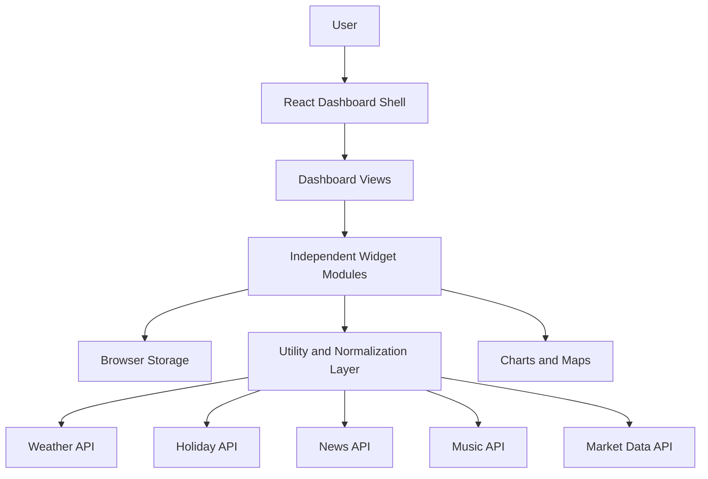

# Personal Dashboard Showcase

A polished, privacy-first showcase of a customizable personal operating dashboard for planning, finance, memories, travel, relationships, and daily context.

> This repository is a public portfolio case study. It documents the product, architecture, and engineering decisions without exposing the private application source code, secrets, database details, or proprietary implementation logic.

## Product Overview

Personal Dashboard is a React-based life management dashboard designed around everyday decision support. It brings together daily context, schedule planning, financial tracking, document organization, memories, travel ideas, relationship notes, and lightweight external data integrations in one calm, widget-driven interface.

The project is intentionally personal in content but professional in engineering approach: modular widgets, persisted user preferences, graceful integration fallbacks, responsive layouts, and clear boundaries between UI state, browser storage, and external API calls.

## Why I Built It

I wanted one interface that could reduce context switching across the tools I use for school, work, finances, memories, travel, and day planning. Instead of treating personal productivity as a generic task list, I built a dashboard that combines practical planning with the small personal signals that make the day easier to navigate.

## Problem It Solves

Personal information is usually scattered across notes apps, calendars, spreadsheets, music apps, finance tools, weather apps, and browser bookmarks. This dashboard consolidates those signals into a single customizable workspace so the user can quickly answer:

- What should I focus on today?
- What deadlines, reminders, and events are coming up?
- How are my finances and savings tracking?
- What documents, memories, trips, and ideas do I want close at hand?
- Which external signals matter today, such as weather, holidays, headlines, music, or market data?

## Target Users

- Students balancing coursework, work, finances, and personal projects.
- Early-career professionals who want a lightweight personal command center.
- Users who prefer a private, local-first dashboard over a SaaS productivity tool.
- People who want planning, journaling, and life-tracking tools in one interface.

## Core Features

- Multi-view dashboard navigation for Home, Productivity, School, Personal, Relationships, Finance, and Explore.
- Widget registry architecture for composing feature modules into reusable dashboard views.
- Daily snapshot with weather, holidays, headlines, moon phase, time-zone context, and Spotify-style music context.
- Planning tools for today’s schedule, important dates, recurring plans, term practice, and document organization.
- Finance tools including savings visualization, paycheck prediction, weekly history, and live/delayed market watchlist support.
- Personal life widgets for reflection, bucket lists, good moments, playlists, career timeline, and keepsakes.
- Travel and food exploration widgets including a map-based travel tracker and restaurant/adventure tracker.
- Local-first persistence using browser storage patterns, with IndexedDB-style handling for larger document blobs.
- Theme support, responsive layouts, collapsible widgets, and error boundaries for resilience.

## Screenshots

> Replace these placeholder files with sanitized screenshots from a demo dataset. Avoid screenshots containing private names, account data, real documents, API responses, client information, or sensitive personal content.

Caption: Add a screenshot of the Home view showing the daily snapshot, daily capture, and overview widgets with sanitized data.

Caption: Add a screenshot of the planning workspace with today’s plan, important dates, term practice, and document vault visible.

Caption: Add a screenshot of the finance workspace showing savings, paycheck prediction, and a demo market watchlist.

Caption: Add a screenshot of the personal dashboard layout with reflection, bucket list, good moments, playlist, and timeline cards.

Caption: Add a screenshot showing sanitized keepsakes, call log summaries, time-zone planning, and relationship-focused widgets.

Caption: Add a screenshot of the travel map and food adventure tracking widgets with fictional or sanitized entries.

Caption: Add a close-up of the document vault using fake document names and placeholder files.

Caption: Add a close-up of the watchlist UI using public ticker symbols and no private account data.

## Feature Walkthrough

The dashboard opens with a daily overview that combines practical signals, such as weather and plans, with personal context. The user can switch between focused views for productivity, finance, personal reflection, relationships, and exploration.

Each widget is implemented as an independent module with its own state boundaries and storage logic. Shared state is passed only where needed, such as the paycheck predictor feeding a savings snapshot. This keeps the dashboard extensible while avoiding a single monolithic state model.

The external data widgets are designed to degrade gracefully. If API credentials are missing or a network request fails, the UI remains usable and presents a clear fallback state instead of breaking the dashboard.

## Tech Stack

| Area | Technologies |
| --- | --- |
| Frontend | React, TypeScript, Vite |
| Styling | Tailwind CSS, custom CSS variables, responsive grid layouts |
| Visualization | Chart.js, react-chartjs-2 |
| Maps | Leaflet |
| Interactions | Drag-and-drop patterns, collapsible widgets, tabbed dashboard views |
| Storage | Browser localStorage, IndexedDB-style document blob persistence |
| External APIs | Open-Meteo, Calendarific, NewsAPI, Spotify API, Alpaca Market Data |
| Quality | TypeScript types, component boundaries, error boundaries, graceful fallbacks |

## Architecture Overview

The private application is organized around a widget registry. The main dashboard shell selects a view, maps view definitions to widget IDs, and renders each widget through a consistent shell. Feature-specific logic stays inside widget modules and utility layers.

At a high level:

- The UI layer renders dashboard views, tabs, widgets, themes, and layout behavior.
- The widget layer owns feature-specific state and interactions.
- The utility layer handles persistence, external API calls, normalization, and formatting.
- Browser storage keeps personal data local to the user’s device.
- External services are optional and configured through environment variables in the private project.

## Data Flow Overview

## AI/ML or Automation Components

The current private implementation is primarily a rule-based and integration-driven dashboard rather than a model-heavy AI application. Automation appears in daily context generation, recurring planning, seeded daily suggestions, market update polling/streaming fallbacks, and local persistence workflows. The architecture leaves room for future AI-assisted summarization, planning recommendations, and natural-language capture without requiring those features to expose private data.

## Engineering Highlights

- Modular widget registry that makes the dashboard easier to extend.
- View-specific layouts tuned for different workflows instead of a single generic grid.
- Defensive parsing and normalization around browser storage and external API responses.
- Graceful handling for missing credentials, unavailable APIs, offline states, and blocked storage.
- Local-first privacy model for personal data.
- Responsive dashboard composition with dynamic measurement for masonry-style personal widgets.
- Clear separation between presentation, feature state, utility functions, and integration logic.

## Security, Privacy, and IP Notice

This public repository intentionally excludes:

- Application source code.
- API keys, tokens, refresh tokens, and environment files.
- Real user data, personal records, documents, or screenshots with private information.
- Database schemas, proprietary algorithms, and implementation-specific business logic.
- Any files that would allow the private application to be cloned and reused.

The materials here are limited to product documentation, high-level architecture, sanitized screenshots, and portfolio-safe engineering notes.

## What I Learned

- How to design a dashboard around real user workflows rather than isolated features.
- How to keep a growing React application maintainable through modular widgets.
- How to build resilient integrations that fail gracefully.
- How to balance personalization with privacy and public portfolio presentation.
- How to document private work in a recruiter-friendly way without leaking implementation details.

## Future Improvements

- Add sanitized demo screenshots and short screen recordings.
- Add a public product tour using mock data.
- Expand accessibility testing and keyboard navigation notes.
- Add a privacy-preserving demo mode.
- Explore AI-assisted summarization for daily planning and reflection.
- Add import/export flows for user-owned local data.

## Project Status

Private project: active personal build.

Public showcase: documentation-only portfolio repository. It is designed for recruiters and technical reviewers who need to understand product thinking, architecture, and engineering judgment without access to private source code.
