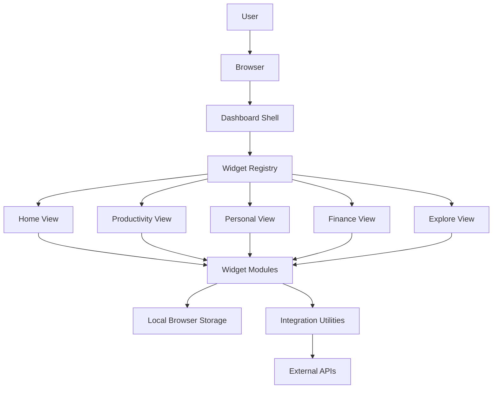
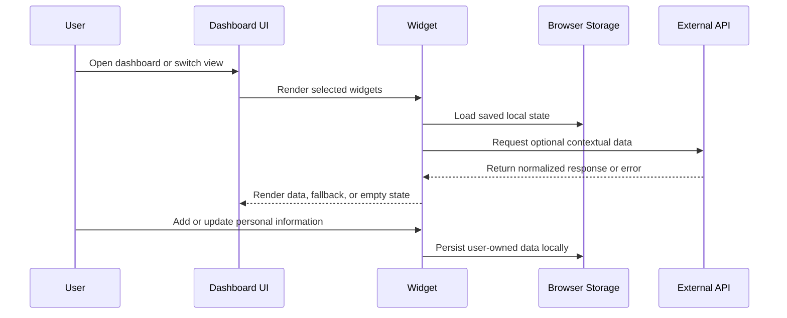

# Architecture

This document describes the public, high-level architecture of the private Personal Dashboard project. It intentionally avoids private source code, secrets, database details, and implementation-specific logic.

## System Overview

Personal Dashboard is a client-side React application composed from independent dashboard widgets. A central dashboard shell controls navigation, theme, and layout. A widget registry maps feature IDs to widget components, allowing views to be assembled declaratively.

## Frontend Layer

The frontend is built with React, TypeScript, Vite, Tailwind CSS, and custom CSS variables.

Primary responsibilities:

- Render dashboard views and view switcher navigation.
- Compose widgets through a consistent widget shell.
- Manage theme selection and responsive layout behavior.
- Provide graceful empty, loading, unavailable, and offline states.
- Keep feature modules visually consistent without forcing identical data models.

The UI is organized around major workflows rather than technical domains: Home, Productivity, School, Personal, Relationships, Finance, and Explore.

## Backend/API Layer

The private project is primarily frontend-driven. Instead of a custom public backend, external data is fetched through isolated integration utilities. These utilities handle request construction, response parsing, normalization, and fallback behavior.

For a production deployment, these integrations could be moved behind a backend-for-frontend service to protect secrets, enforce rate limits, and centralize observability. The public showcase does not include private endpoint details or API credential handling.

## Data Layer

The dashboard follows a local-first data model for personal information.

High-level storage categories:

- Lightweight preferences and widget state in browser storage.
- Personal records such as plans, dates, notes, lists, and watchlists in browser-managed persistence.
- Larger document-style content through a browser storage mechanism suitable for blobs.

No real user data is included in this showcase repository.

## External APIs

The private dashboard integrates with optional external services for contextual data:

- Weather data.
- Holiday/calendar data.
- News headlines.
- Music listening context.
- Market data.
- Map rendering assets and geographic visualization.

Integrations are designed to fail gracefully. Missing credentials, unavailable services, and network errors should produce clear widget states instead of breaking the dashboard.

## AI/LLM Services

The current architecture does not require an AI/LLM service to function. Future AI-assisted features could be added behind explicit privacy controls, such as:

- Daily planning summaries.
- Reflection prompts.
- Document note summarization.
- Natural-language capture for tasks or memories.

Any future AI feature should avoid sending sensitive personal content without explicit user consent and should support redaction or local-only modes where possible.

## Authentication and Security

The private project is designed as a personal dashboard. Public showcase materials do not include authentication implementation details, secrets, tokens, or account data.

Security and privacy considerations:

- Keep API credentials out of source control.
- Use environment variables only in private development settings.
- Prefer server-side token handling for production deployments.
- Avoid committing real screenshots, documents, financial records, or personal notes.
- Sanitize demo data before public presentation.
- Treat browser storage as private-to-device, not as secure encrypted storage.

## Deployment Assumptions

The private application can be built as a static frontend bundle. A production deployment could use:

- Static hosting for the React application.
- A backend proxy for credentialed API calls.
- Environment-specific configuration.
- Optional authenticated access if deployed beyond local use.

This showcase repository does not include deployment files for the working private application.

## High-Level Data Flow

## Component Boundaries

- Dashboard shell: view selection, layout orchestration, shared cross-widget state.
- Widget shell: consistent framing, title handling, collapse behavior, and error containment.
- Feature widgets: domain-specific UI and interactions.
- Utility modules: storage, API access, data normalization, calculations, and formatting.
- Styling system: shared tokens, themes, responsive grid behavior, and widget-level styling.

## Privacy Boundary

The public documentation intentionally stops at architectural descriptions. It does not expose exact code paths, private data structures, API keys, private algorithms, or reusable implementation files.
